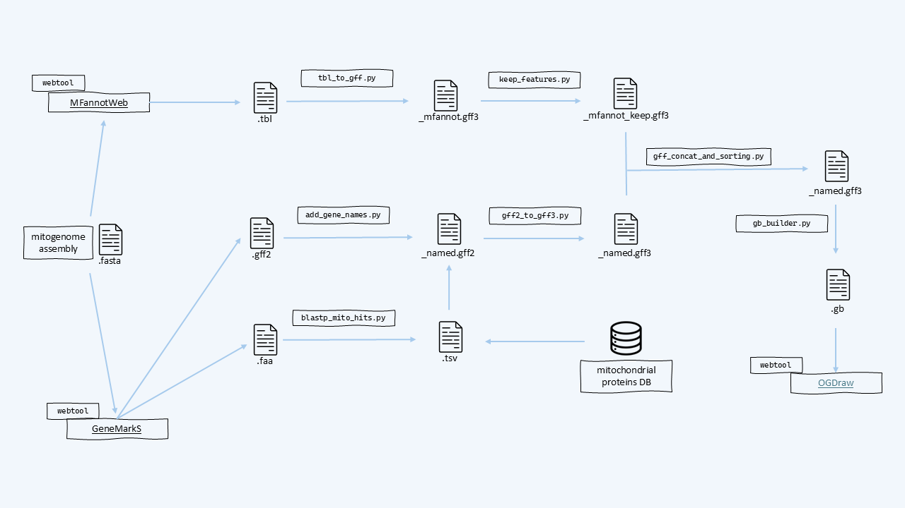

# PRIMA

**PRIMA** (**PR**otist **I**ntegrated **M**itogenome **A**nnotation) is a lightweight Python pipeline for the annotation of protist mitochondrial genomes. The pipeline requires a previously assembled mitochondrial genome FASTA file. This sequence must be first submitted to the GeneMarkS and MFannot web servers to generate the input files required by PRIMA. The aim of this pipeline is to quickly overcome the problems tied to file formats between the two web tools generating a GENBANK file for the visualization of the mitogenome annotation with the OGDRAW web tool.

PRIMA integrates:

* GeneMarkS protein-coding gene predictions
* BLASTP-based functional annotation against a custom mitochondrial protein database
* MFannot RNA annotations and protein-coding gene predictions
* GenBank file generation for downstream visualization with OGDRAW


## Requirements

PRIMA was written in Python 3.13 and requires ```biopython and bcbio-gff``` installed

#### BLAST

Install BLAST+ https://ftp.ncbi.nlm.nih.gov/blast/executables/blast+/LATEST/. BLAST executables must be installed and available in your `$PATH`.

#### Custom mitochondrial protein database

ATTENTION! PRIMA is not shipped with any database.PRIMA assigns putative gene names to GeneMarkS predictions by searching a user-defined protein database with BLASTP.

The database can be fully customized according to the user's taxonomic group or research interests. In the example directory a the BLAST database was build using all manually annotated mitogenomes of the ciliate of the genus Paramecium from https://paramecium.i2bc.paris-saclay.fr/ and the assembled mitogenome FASTA file retrieved from https://ncbi.nlm.nih.gov/nucleotide/NC001324 

Create the BLAST database using:

```bash
makeblastdb \
    -in mito_proteins.faa \
    -dbtype prot \
    -out mito_database
```

and provide the resulting database prefix through:

```bash
--db mito_database
```

The quality and specificity of the final annotation depend on the composition of this database.

## Installation

Clone the repository:

git clone https://github.com/Anomalocaris98/PRIMA.git


or download the repository as a ZIP archive from GitHub and extract it.


## Workflow Overview



**Figure 1.** Overview of the PRIMA annotation workflow.

### 1. Prepare the mitochondrial genome

Start from an assembled mitochondrial genome FASTA file.

Submit the sequence to:

* GeneMarkS: https://exon.gatech.edu/genemarks.cgi
* MFannot: https://megasun.bch.umontreal.ca/apps/mfannotweb/

- MFAnnot outputs a .zip archive; the only file of interest is the .tbl one.
- remember to output a GFF in GeneMarkS webtool, open the results in new browser tabs, copy and paste them in the directory as shown below. 


### 2. Create a working directory

**ATTENTION!** 

Place all files associated with a single mitochondrial genome in the same directory using a common prefix.

Example:

```text
Paramecium_aurelia/
├── Paramecium_aurelia.faa 
├── Paramecium_aurelia.gff
├── Paramecium_aurelia.tbl
└── Paramecium_aurelia.fsa
```

where:

```text
.faa  = GeneMarkS predicted proteins
.gff  = GeneMarkS annotation file
.tbl  = MFannot annotation table
.fsa  = mitochondrial genome FASTA
```

The filename prefix must be identical for all files.

### 3. Run PRIMA

PRIMA can be executed in three different modes depending on the desired annotation strategy. 

From inside the working directory, input the absolute path for the prima.py script and the absolute path where the various BLAST+ database files are located.

Example:

```bash
python3 prima.py full \
    --prefix SAMPLE \
    --db mito_database \
    --evalue 1e-20 \    #optional, default is 1e-10
    --threads 32        #optional, default is 8
```
### Full mode (recommended)


```bash
python3 prima.py full \
    --prefix SAMPLE \
    --db mito_database
```
```text
Combines GeneMarkS and MFannot annotations.

Workflow:

GeneMarkS CDS annotation
            +
MFannot RNA annotation
            ↓
Merged annotation
            ↓
GenBank output
```

Produces a complete GenBank (manually curate the .gb file after creation!):

-Protein-coding genes
-tRNAs
-rRNAs
-ORFs

### GeneMark mode

```bash
python3 prima.py genemark \
    --prefix SAMPLE \
    --db mito_database
```
```text
Uses only GeneMarkS predictions.

Workflow:

GeneMarkS proteins
        ↓
BLASTP annotation
        ↓
Gene naming
        ↓
GenBank output
```
Produces a GenBank file containing only protein-coding genes.

### MFannot mode

```bash
python3 mitoannotate.py mfannot \
    --prefix SAMPLE
```

Uses only MFannot predictions.
```text
Workflow:

MFannot annotations
        ↓
RNA extraction
        ↓
GenBank output
```
---

## Output

Results are written to:

```text
results/
```

and include:

```text
PREFIX.gb
PREFIX_genemark.gff3
PREFIX_mfannot.gff3
PREFIX_merged.gff3
PREFIX_blastp_mito_hits.tsv
```

The final `PREFIX.gb` file can be uploaded directly to OGDRAW https://chlorobox.mpimp-golm.mpg.de/OGDraw.html for graphical visualization.


## Test dataset

If you are willing to try PRIMA run the script inside the /example directory 


## Repository Structure

```text
PRIMA/
├── prima.py
├── requirements.txt
├── scripts/
│   ├── normalize_fasta.py
│   ├── blastp_mito_hits.py
│   ├── add_gene_names.py
│   ├── gff2_to_gff3.py
│   ├── tbl_to_gff3.py
│   ├── keep_features.py
│   ├── gff_concat_and_sorting.py
│   └── gb_builder.py
├── example/
|   ├── Paramecium_aurelia.faa
|   ├── Paramecium_aurelia.fsa
|   ├── Paramecium_aurelia.gff
|   └── Paramecium_aurelia.tbl
├── db/
├── docs/
│   └── mito_annotation_pipeline.png
└── README.md
```


## License

MIT License

---

## Contact

This is version 1 of the pipeline, so erros and bugs are expected. If you want to use this simple tool kindly cite the GitHub repository.

---

